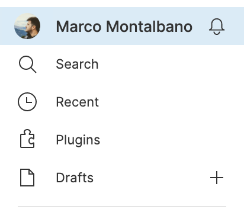

<p align="center">
    
</p>

<p align="center">
    Export tool for Figma.
</p>

# figma-export

## Getting Started

### Personal Access Token

First of all you have to set the environment variable `FIGMA_TOKEN`.

To do so, you need a **Personal Access Token**. You can generate one from your *Account Settings*.



Inside the Account Settings click on *Create a new personal access token* and enter a description.

Copy the token, this is your only chance to do so!

```sh
export FIGMA_TOKEN=<personalAccessToken>
```

### Build Process

You can use `figma-export` as part of your build process.

```sh
npm install --save-dev @figma-export/cli

# or using `yarn`
yarn add @figma-export/cli --dev
```

Nowyou can create a `script` command inside your `package.json`.

Following an example:

```json
...
    "scripts": {
        "figma:export": "export FIGMA_TOKEN=<personalAccessToken> figma-export components FP7lqd1V00LUaT5zvdklkkZr"
    }
...
```

### Use it on the fly

Alternatively you can use `npx` to use it on the fly:

```sh
npx @figma-export/cli <command> <fileId>
```
